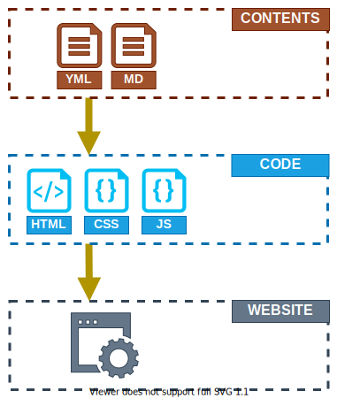
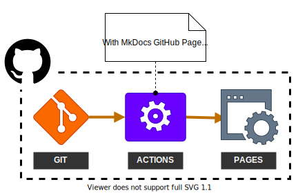

# For Starters, How This Was Built

## Idea and Concept

I always planned to create a website, but I didn't really have the motivation
to go for it. I've always been more of the Machine Learning and back-end
person. Though I worked recently with [Jetpack Compose]. Pretty fun!

Well, speaking of websites, surprisingly I made a lot of them. But these are
the documentation websites for the APIs and library I developed. So my idea
is to leverage these tools so I can have some things to start with, the build
things from there. *You know, the agile way.*

<figure markdown>

<figcaption>Website Generation from Documentation</figcaption>

</figure>

## Documentation Tool

I've always used [Sphinx] for my documentation needs, mostly because I worked
a lot in Python. But as I worked with other languages, I looked for
alternatives that worked well with other pages. And from there I found
[MkDocs].

[MkDocs] uses markdown files in order to create documentation. This is
something familiar as most `README` files are written in markdown.

[MkDocs] also has a theme called [MkDocs Material]. It looks good and has a
lot of customization options that are available. I am so impressed with how
much it provides out of the box.

## Deployment

The code is hosted in [GitHub], so it was easy to go for deploying it in
[GitHub Pages] with [GitHub Actions]. Documentations are mostly static web
pages so [GitHub Pages] are enough for it. For CI, [MkDocs] and
[MkDocs Material] have you covered with their [GitHub Actions] support and
examples.

<figure markdown>

<figcaption>GitHub Deployment From Git to Pages</figcaption>

</figure>

## Domain Name

[GitHub Pages] also supports custom domain names. They also provide HTTPS once
deployed with [Let's Encrypt]. For domain names, one can get them from
[Freenom] for free for as long as 1 year. *As to why I chose [Freenom], well,
I've been using it for our Minecraft servers.*

## Wrapping Up

Granted, at the end of the day, documentation tools are made for their
purpose. Creating your own personal website will still give you more creative
freedom.

However, being able to write my thoughts out in something I can version is
something I value. [MkDocs Material] also has everything I want, both in
terms of functionality and visual.

*Who knows? Maybe in the future, I can move the things I have written in a
proper website I created.*

[Jetpack Compose]: https://developer.android.com/jetpack/compose (Jetpack Compose)
[Sphinx]: https://www.sphinx-doc.org/en/master/
[MkDocs]: https://www.mkdocs.org/ (MkDocs)
[MkDocs Material]: https://squidfunk.github.io/mkdocs-material/ (MkDocs Material)
[GitHub]: https://github.com/baluyotraf (GitHub: baluyotraf)
[GitHub Actions]: https://github.com/features/actions (GitHub Actions)
[GitHub Pages]: https://pages.github.com/ (GitHub Pages)
[Freenom]: https://www.freenom.com/en/index.html (Freenom)
[Let's Encrypt]: https://letsencrypt.org/ (Let's Encrypt)