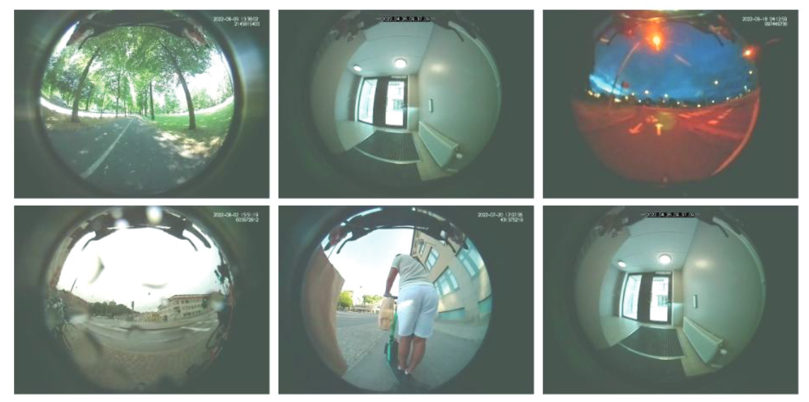

# Hejdå Autoliv!

Today, March 15, 2024, I spent my last day in Autoliv. I went to the Vårgårda
office to meet my colleagues from research and gave everyone thanks. In
return I also got a lot of compliments. Oh and there's some depth estimation
project where my input was appreciated.

Thinking about it, my contract lasted for 1 year and 10 months. And I thought
it would be nice to look back at the things I've done with the team.

## Documentation Hub

In the team, we generate our documentation using automated tools. Each
programming language however has their own tooling around documentation. For
example, we have mkdocs/Sphinx for Python, Dokka for kotlin, etc. Each project
generates their documentation, then send its documentation to the 
**Documentation Hub**.

To make it easier for people to integrate their documentation to the hub,
I created an Azure Pipeline Template to allow people add the process to their
CI pipeline. The page for the **Documentation Hub** is actually public, but I 
am not sure if I am allowed to share it. Though there's not much to get there
as the private information and keys requires an Autoliv account.

## Autoliv Connected Services Platform

The Autoliv Connected Services Platform is a service that existed before I came
in. However, it was more of a POC rather than a production ready system. After
I came in, we came to a conclusion that we had to rework the system.

Now that I'm leaving, the system is ready for production and its iOS 
application is in Apple test flight. I won't go through the details but below 
is a summary of the things I contributed to the system.

*   Database Migrations, Proper Indexing and Constraints
*   RESTful APIs
*   Kotlin Multiplatform SDK for iOS/Android
*   Android Demo Application
*   Service Now and Azure AD Integration (OpenIDC)
*   Pre-commit and CI Pipelines
*   Full Unit and Integration Test Suite via Docker Compose
*   Autoliv Security Approval
*   Data Migration Script

In the end, I am happy to see that everything is sorted out before I leave and
that the application will be ready to go prime time.

## E-Safe Pre-Study

Electric powered mobility solutions has been gaining popularity. After coming
to Autoliv, I had to work on a research project for Vinnova. The paper is
available in the [Vinnova Publication] for more details.

In the project, we got a lot of data from electric scooters with front facing
cameras. My main contribution on the project are the computer vision outputs.
This means working mostly on object detection, distance estimation, object
tracking, and video stabilization. Below are some of the examples of the data
we processed, as shown in the paper.

[Vinnova Publication]: https://www.vinnova.se/en/p/e-safe-pre-study/

## Motorcycle Airbags

Autoliv has officially announced its [Motorcycle Airbags] and I was one of the
person who is working on it. Specifically, I was working on the algorithm to
detect when should we trigger the airbag. It was a lot of watching videos of
motorcycles and dummies getting decimated in the crash track and processing
time series data to make sure the kinematic data matches the video.

[Motorcycle Airbags]: https://www.autoliv.com/press/autoliv-launch-its-first-motorcycle-airbag-2025-2132315

## Thesis Projects

I had also supported our thesis students who are working on LLMs and 
transportation mode classification. Unfortunately, I did not stay long enough 
to see their presentation. But I believe they are at the stage where they can 
continue the work together with the members of the team. I hope they make a 
good paper!

## Next Chapters

As I wait for my next assignment or next opportunity, I've been planning on
working on the following things.

*   Continue my courses on Explainable AI and Machine Learning for Predictive
    Maintenance.
*   Write an open source library for typed and composable handwritten SQL
    in Python. Current planned name is alternative queries (altqq).
*   Keep up with the latest advancements in LLMs. Thankfully I did work with a
    chatbot company before and have the fundamentals to built my knowledge on.