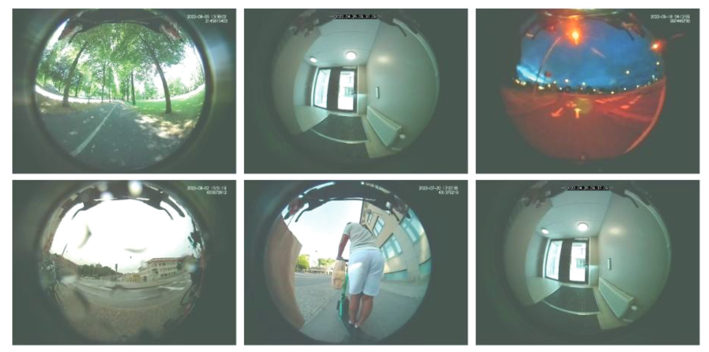

---
authors:
  - baluyotraf
date: 
    created: 2024-03-15
    updated: 2024-03-22
categories:
  - software
  - machine-learning
---

# Hejdå Autoliv!

Today, March 15, 2024, I spent my last day in Autoliv. I went to the Vårgårda
office to meet my colleagues from research and gave everyone thanks. In
return, I also got a lot of compliments. Oh, and there's some project where my 
input was appreciated.

<!-- more -->

Thinking about it, my contract lasted for 1 year and 10 months. And I thought
it would be nice to look back at the things I've done with the team.

## Software Services

A lot of the things we did in research are software driven, without going to
details of the services, here are the things I added to those services.

*   Database Migrations, Proper Indexing and Constraints
*   RESTful APIs
*   Kotlin Multiplatform SDK for iOS/Android
*   Android Application
*   ServiceNow and Azure AD Integration (OpenIDC)
*   Pre-commit and CI Pipelines
*   Reusable CI Templates
*   Automated Documentations
*   Full Unit and Integration Test Suite via Docker Compose
*   Security Review
*   Data Migration Script

## E-Safe Pre-Study and Other Research

Electric powered mobility solutions has been gaining popularity. After coming
to Autoliv, I had to work on a research project for Vinnova. The paper is
available in the [Vinnova Publication] for more details.

In the project, we got a lot of data from electric scooters with front facing
cameras. My main contribution to the project are the computer vision outputs.
This means working mostly on object detection, distance estimation, object
tracking, and video stabilization. Below are some of the examples of the data
we processed, as shown in the paper.

Aside from this, there are also other internal researches that I've been a part
of, both with employees and thesis students.

[Vinnova Publication]: https://www.vinnova.se/en/p/e-safe-pre-study/

## Motorcycle Airbags

Autoliv has officially announced its [Motorcycle Airbags], and part of the work
I've done is making sure that the crash algorithm is robust and capable.

[Motorcycle Airbags]: https://www.autoliv.com/press/autoliv-launch-its-first-motorcycle-airbag-2025-2132315

## Next Chapters

As I wait for my next assignment or next opportunity, I've been planning on
working on the following things.

*   Continue my courses on Explainable AI and Machine Learning for Predictive
    Maintenance.
*   Write an open source library for typed and composable handwritten SQL
    in Python. Current planned name is alternative queries (altqq).
*   Keep up with the latest advancements in LLMs. Thankfully, I did work with a
    chatbot company before and have the fundamentals to built my knowledge on.